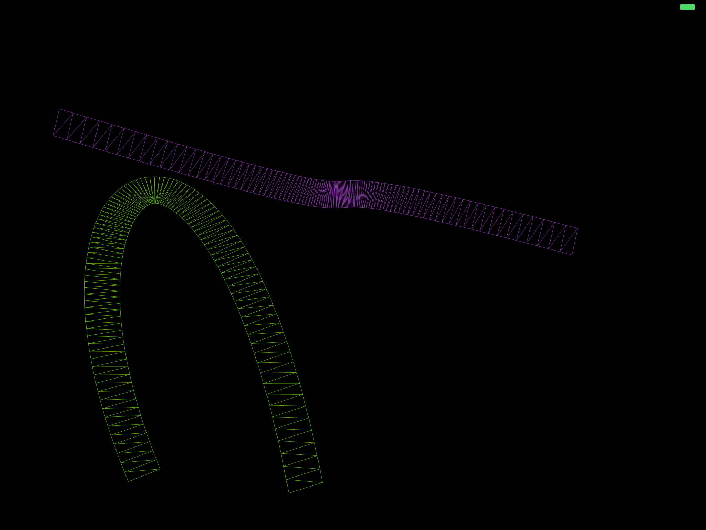

# High-performance Bezier Curves in the GPU with Metal
Lately I've been working on a project to achieve high-performance 2D graphics on iOS using Metal. It's interesting in that tasks that used to be supported by the fixed hardware in the older graphics processors have, in recent years, become a bit more challenging and less of a natural fit for today's modern GPU hardware.

In this project I spent some time playing with rendering Bezier curves completely in the GPU and measuring the kind of performance that can be achieved. Other OpenGL implementations I was able to find online appeared to be cheating: They were actually calculating the vertices on the CPU and feeding the calculated data to the GPU, so all the GPU was doing was actually drawing the triangles to the screen. This is surprising given that the GPU appears to be very well suited to perform these kinds of calculations. Here is what the output of my test program looks like:

In this implementation the Bezier curve is fully calculated in the vertex shader, which achieves very high performance. The test program renders several thousand Bezier curves animating at 60FPS with perfect smoothness (and with 4x MSAA).

## Visualizing the triangles
As with any GPU-based rendering, we use triangles to actually render our curves, which significantly complicates the vertex shader and adds cost. We could use simple lines and just have each vertex shader calculate a single point, but then all we'd get is a fixed-width curve. Instead, we compute triangles out of the curve and render those, which allows us to choose our thickness. Depending on the length of the curve and on the screen resolution, it appears that a couple of hundred triangles tend to be sufficient to achieve a nice smooth curve on an iPad's screen.

Here is a wireframe image showing a single curve, to illustrate how the triangles are used to express the curve:

## A note about performance
While the code does perform well enough for most application, the performance is actually a bit unimpressive. For example, in terms of triangles/sec, the iPad Pro appears to be achieving around 2000 curves consisting of 200 triangles each at around 40FPS (around 25ms/frame). That equates a roughly 16M triangles/sec fillrate, which is **significantly** below
the expected performance for that device.

It is possible that the vertex shader computational load is the bottleneck, but Instruments and the GPU profiler inside Xcode are telling a different story, and are indicating that most of the time is being spent in the fragment shader (which in this implementation should be doing absolutely nothing).

Another interesting data point is the fact that while increasing the number of curves dramatically increases the per-frame GPU render time, merely increasing the number of triangles *per curve* has a much smaller impact on overall performance.

For example, on the same iPad Pro, doubling the number of triangles-per-curve from 200 to 400 only increases the per-frame time to around 31ms. That's a 24% increase after we basically doubled the GPU's workload!

By way of comparison, if we double the number of curves instead (keeping the per-curve triangle count at 200), performance drops to around 47ms per frame.
